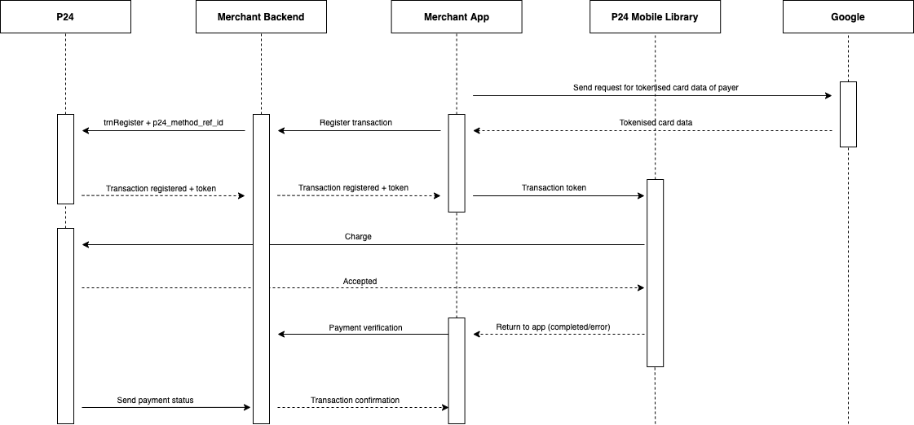
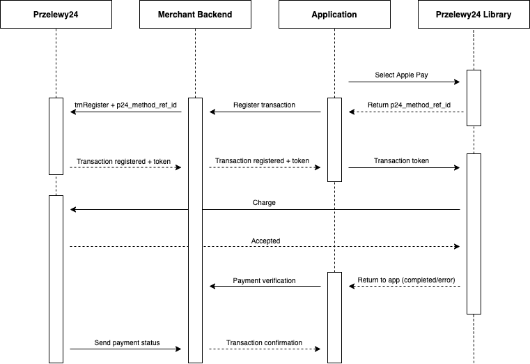

# Przelewy24 library documentation - Flutter

For general information on the operation of Przelewy24 mobile libraries, visit:

- [https://github.com/przelewy24/p24-mobile-lib-doc](https://github.com/przelewy24/p24-mobile-lib-doc)

## 1. Project configuration

|For iOS only|
|-|
|In project Xcode settings set „iOS Deployment Target” ( „Info” project settings bookmark) to version 9.0 or newer. Version 9.0 is the minimum requirement for the library to work properly with the iOS. |
||

### Adding dependencies

For correct import of dependencies it is necessary to add code

```  
p24_sdk: ^x.x.x
```

to `pubspec.yaml` of project in `dependencies` section.

To use the library, you must import the file `p24_sdk`:

``` import 'package:p24_sdk/p24_sdk.dart'; ```

## 2. SSL Pinning

The library has a Pinning SSL mechanism that can be activated globally for webview calls.
If you want use this feature, please make sure configuration is setup before any library methods calls. Example:

```dart
await SdkConfig.setCertificatePinningEnabled(true);
```

**NOTE!!**

 > When activating SSL Pinning, keep in mind that the certificates embedded in the library have their validity time. Before time of their expiry, Przelewy24 will be sending out appropriate information and updating.

## 3. Finish on back button

The library makes possible to control behaviour of back button when WebView was called. Function is disabled by default - back button in library behaves similarly to back button in Web browser. Change param configuration on true makes, that after back button is clicked, WebView will be closed.
Params settings should take place before call any methods of P24 library. Change default configuration could be triggered by method:

```dart
await SdkConfig.setFinishOnBackButtonEnabled(true);
```

## 4. Before call any library methods

Before call any library methods it is necessary to define `merchant` in P24 mobile lib. `Merchant` is the object implementing interface `P24Merchant`, f.e:
```dart
class DefaultMerchant implements P24Merchant {
  @override
  Map<Environment, String> get crc => {
    Environment.SANDBOX : "default_merchant_sandbox_crc",
    Environment.PRODUCTION : "default_merchant_production_crc"
  };

  @override
  int get id => merchant_id;
}
```
Above object should be passed to P24 mobile library by call below method:
```dart
await P24Config.setP24Merchant(DefaultMerchant());
```

## 5. trnRequest transaction call

During the registration with the "trnRegister" method, additional parameters should be provided:
- `p24_mobile_lib=1`
- `p24_sdk_version=X` – where X is a moibile lib version provided by 
```dart
P24SdkVersion.value().then((value) => print("Sdk version: $value"));
```

This parameters allows Przelewy24 to classify the transaction as a mobile transaction. A Token registered without this parameter will not work in the mobile application (an error will appear upon return to the bank and the library file will not detect payment completion).

**NOTE!**

 > When registering a transaction which is to be carried out in a mobile library, remember about the additional parameters:
- `p24_channel` – unless set, the library will feature the payment options „traditional transfer” and „use prepayment”, which are unnecessary in case of mobile payments. In order to deactivate them, use flags that disregard these forms (e.g. value 3 – payments and cards, default entry setting, directly with parameters)
- `p24_method` – if a given transaction in the library is to have a specific, preset method of payment, this method must be selected during the registration
- `p24_url_status` - the address to be used for transaction verification by the partner’s server once the payment process in the mobile library is finished

The transaction parameters must be set using the token of a transaction registered earlier. Optionally, the environment may be set with `Environment.PRODUCTION` or `Environment.SANDBOX` value (default `Environment.PRODUCTION`):

```dart
TrnRequestParams params = TrnRequestParams(token: _token, environment: _environment);
```

Next, call the `trnRequest` method:

```dart
P24SDK.trnRequest(params).then((response) {
    // handle response
});
```

Response is `SdkResult` object consist of `payload` field (optional, containing error code) and `SdkStatus` object receiving one of three type: **success** | **error** | **cancel**

## 6. trnDirect transaction call

Firstly, `TrnDirectParams` object should be created. Object contructor looks like:

```dart
TrnDirectParams({@required String sessionId, @required int amountInGr, 
@required String currency,@required String description, @required String email, @required String country,
String client, String address, String zip, String city, String phone, String language, int method,
String urlStatus, int timeLimit, int channel, int shipping, String transferLabel, String methodRefId,
PassageCart passageCart, Environment environment, P24Merchant merchant})
```

Params marked with `@required` adnotations are mandatory, which must be filled. Another params are optional. PassageCart object should be passed in passage transaction (paragraph 7). Environment object, like in TrnRequest case, can be set with `Environment.PRODUCTION` oraz `Environment.SANDBOX` value. `P24Merchant` object allows override the default library merchant set in the library configuration to other for a given transaction.

After creation of `TrnDirectParams` object, call the `TrnDirectMethod`:

```dart
P24SDK.trnDirect(params).then((response) {
    // handle response
});
```

Object `SdkResult` is returned as response (described at paragh 4).

## 7. Express transaction call

Firstly, `ExpressParams` object should be created:

```dart
ExpressParams params = ExpressParams(url: _expressUrl);
```

where `_expressUrl` was received during transaction register at Express system.

After creation of `ExpressParams` object `Express` method could be called:

```dart
P24SDK.transferExpress(params).then((response) {
    // handle response
});
```

Object `SdkResult` is returned as response (described at paragh 4).

## 8. Passage 2.0 transaction call

Firstly, `TrnDirectParams` object should be created, similarly to TrnDirect, adding `PassageCart` object:

``` dart

List<PassageItem> _items = List<PassageItem>();

// loop for items list
PassageItem item = PassageItem(
          name: "Product name",
          description: "Product description",
          number: 1,
          price: 100,
          quantity: 2,
          targetAmount: 2,
          targetPosId: XXXXX
      );

_items.addItem(item);
// end of loop

PassageCart cart = PassageCart(_items);
```

At above example amount from `targetAmount` will be passed on billing acount XXX `targetPosId`. Fields `description` and `number` regarding to documentation of `Pasaż 2.0` service are optional.

```dart
//earlier created object TrnDirectParams
trnDirectParams.passageCart = cart;
```

Transaction call and parsing result are processed same as in `trnDirect` case.

## 9. Google Pay (Android)

The data flow process using this payment method looks as follows:

 

After selecting GooglePay method, seller application should send request for tokenised payer data to Google. After receiving the callback, tokenised data should be passed as value of params `p24_method_ref_id` to seller backend in registration transaction request. Transaction registration should take place in accordance with the documentation: **[https://docs.przelewy24.pl/Google_Pay](https://docs.przelewy24.pl/Google_Pay)**. After registering the transaction, seller app should call P24 GooglePay method from mobile library with received token and proper environment:

```dart
GooglePay params = GooglePay(
    token: _token,
    environment: _getEnvironment()
);


P24SDK.googlePay(params).then((value) {
    //handle response
});
```

Object `SdkResult` is returned as response (described at paragh 4).

## 10. Apple Pay (iOS)

The data flow process using this payment method looks as follows:

 

To use the Apple Pay payment you must first make an additional configuration of the project according to official Apple documentation:

**[https://developer.apple.com/documentation/passkit/apple_pay/](https://developer.apple.com/documentation/passkit/apple_pay/)**

To initiate a transaction, you must pass the transaction parameters and the `ApplePayTransactionRegistrar` object that is used to register the transaction:

```dart
ApplePayParams params = ApplePayParams.withSingleItem(
    appleMerchantId: APPLE_MERCHANT_ID,
    amount: AMOUNT_IN_GR,
    currency: CURRENCY,
    description: DESCRIPTION,
    isSandbox: IS_SANDBOX
);

P24SDK.applePay(params, getApplePayTransactionRegistrar()).then((response) {
    //handle response
});
```

Alternatively, in `ApplePayParams` object instead of amount and description can be passed objects list of type `PaymentItem`:

```dart
ApplePayParams params = ApplePayParams.withMultipleItems(
    appleMerchantId: APPLE_MERCHANT_ID,
    items: [exampleItem, exampleItem2],
    currency: CURRENCY,
    isSandbox: IS_SANDBOX
);

P24SDK.applePay(params, getApplePayTransactionRegistrar()).then((response) {
    //handle response
});
```

Object `PaymentItem` consists of `itemDescription` and `amount` fields:

```dart
PaymentItem exampleItem = PaymentItem(description: DESCRIPTION, amount: AMOUNT);
```

**NOTE**

>*The parameter `appleMerchantId` is the ID obtained from the Apple Developer console. You should pay attention that this is not the same as the `merchant_id` from Przelewy24.*


The `ApplePayTransactionRegistrar` interface allows you to implement the exchange of the token received from Google Pay into the P24 transaction token. When the `exchange` method is called, communicate with the P24 servers, pass the Google Pay payment token as the `p24_method_ref_id` param, and then pass the transaction token to the library using the callback:

```dart
@override
    Future<ApplePayExchangeResult> exchange(String methodRefId) {
        //In this place your backend should register transaction in P24 and retrieve transaction token.
        var result = ApplePayTransactionRegistered(transactionToken: "CD77A8A04F-3E83BC-7C1044-0EFF8933DF");
        return Future.value(result);
    }
```

Object `SdkResult` is returned as response (described at paragh 4).