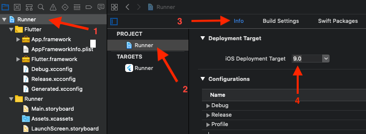
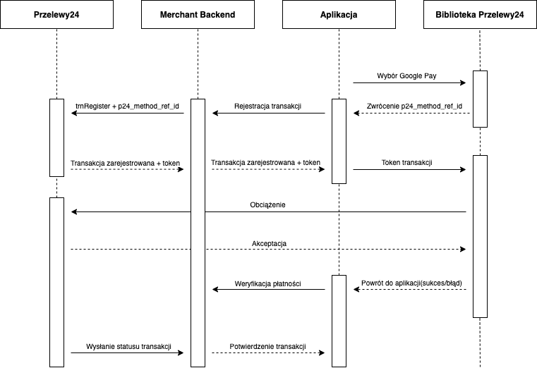

# Dokumentacja biblioteki Przelewy24 - Flutter

Ogólne informacje o działaniu bibliotek mobilnych w systemie Przelewy24 znajdziesz pod adresem:

- [https://github.com/przelewy24/p24-mobile-lib-doc](https://github.com/przelewy24/p24-mobile-lib-doc)


## 1. Konfiguracja projektu

W ustawieniach projektu Xcode należy ustawić „iOS Deployment Target” (zakładka „Info” ustawień projektu) na wersję 9.0 lub nowszą. Wersja 9.0 to minimalna wersja systemu iOS wymagana do poprawnego działania biblioteki.



### Dodawanie zależności

Do poprawnego zaimportowania zależności konieczne jest dodanie do pliku **pubspec.yaml** projektu w sekcji **dependencies** fragmentu:

```  
p24_sdk: ^x.x.x
```

By móc korzystać z biblioteki należy zaimportować plik `p24_sdk`:

``` import 'package:p24_sdk/p24_sdk.dart'; ```


## 2. SSL Pinning

Biblioteka posiada mechanizm SSL Pinningu, który można aktywować globalnie dla wywołań WebView.
Aby funkcja działała należy upewnić się, że przed wywołaniem jakiejkolwiek metody biblioteki jest ona odpowiedno skonfigurowana. Przykład:

```dart
await SdkConfig.setCertificatePinningEnabled(true);
```

**UWAGA!!**

 > Aktywując SSL Pinning należy mieć na uwadze, że zaszyte w bibliotece certyfikaty mają swój czas ważności. Gdy będzie się zbliżał czas ich wygaśnięcia, Przelewy24 poinformują o tym oraz udostępnią odpowiednią aktualizację.

## 3. Finish on back button

Biblioteka umożliwia sterowanie zachowaniem przycisku wstecz w momencie wywołania WebView. Domyślnie funkcja jest wyłączona - przycisk wstecz zachowuje się analogicznie do przycisku wstecz w przeglądarce. Zmiana konfiguracji flagi na true sprawia, że po naciśnięciu przycisku wstecz WebView jest zamykane.

Ustawienie flagi powinno odbywać się przed wywołaniem metod biblioteki. Zmiana domyślnej konfiguracji odbywa się przez wywołanie metody:

```dart
await SdkConfig.setFinishOnBackButtonEnabled(true);
```

## 4. Wywołanie transakcji trnRequest

Podczas rejestracji transakcji metodą `trnRegister` należy podać dodatkowe parametry:
- `p24_mobile_lib=1`
- `p24_sdk_version=X` – gdzie X jest wersją biblioteki mobilnej otrzymana w wywołaniu metody `P24SDK.getSdkVersion()`

Zdefiniowanie wskazanych wyżej parametrów sprawi, że transakcja zostanie zidentyfikowana w systemie Przelewy24 jako transakcja mobilna. Brak tych parametrów spowoduje nieprawidłowe zachowanie biblioteki - nie zostanie wykryte zakończenie płatności.

**UWAGA!**

 > Rejestrując transakcję, która będzie wykonana w bibliotece mobilnej należy
pamiętać o dodatkowych parametrach:
- `p24_channel` – jeżeli nie będzie ustawiony, to domyślnie w bibliotece pojawią się formy płatności „przelew tradycyjny” i „użyj przedpłatę”, które są niepotrzebne przy płatności mobilnej. Aby wyłączyć te opcje należy ustawić w tym parametrze flagi nie uwzględniające tych form (np. wartość 3 – przelewy i karty, domyślnie ustawione w bibliotece przy wejściu bezpośrednio z parametrami)
- `p24_method` – jeżeli w bibliotece dla danej transakcji ma być ustawiona domyślnie
dana metoda płatności, należy ustawić ją w tym parametrze przy rejestracji
- `p24_url_status` - adres, który zostanie wykorzystany do weryfikacji transakcji przez serwer partnera po zakończeniu procesu płatności w bibliotece mobilnej

Należy ustawić parametry transakcji podając token zarejestrowanej wcześniej transakcji, opcjonalnie można ustawić serwer sandbox:

```dart
TrnRequestParams params = TrnRequestParams(token: "XXXXXXXXXX-XXXXXX-XXXXXX-XXXXXXXXXX", isSandbox: true);
```

Następnie należy wywołać metodę `trnRequest`:

```dart
P24SDK.trnRequest(params).then((response) {
    // handle response
});
```

Response jest obiektem `SdkResult` składającym się z pola payload (w którym zawarty będzie ewentualny komunikat błędu) oraz obiektu `SdkStatus` przyjmującego jeden z trzech typów - **success**, **error** bądź **cancel**.

## 5. Wywołanie transakcji trnDirect

Na początku należy stworzyć obiekt `TransactionParams`. Konstruktor obiektu wygląda następująco:

```dart
TransactionParams({@required int merchantId, @required String crc,
  @required String sessionId, @required int amount,
  @required String currency, @required String description,
  @required String email, @required String country,
  String client, String address, String zip, String city, String phone,
  String language, int method, String urlStatus, int timeLimit,
  int channel, int shipping, String transferLabel, String methodRefId, PassageCart passageCart})
```

Parametry oznaczone adnotacją @required są parametrami obowiązkowymi, które muszą zostać wypełnione, pozostałe parametry są opcjonalne. Obiekt `PassageCart` powinien być przekazany w momencie wywołania transakcji pasażowej (pkt. 7).

Po stworzeniu obiektu `TransactionParams` należy stworzyć kolejny obiekt z parametrami wywołania transakcji, odpowiedni dla danej metody, a opcjonalne można ustawić wywołanie transakcji na środowisko sandbox:

```dart
TrnDirectParams params = TrnDirectParams(transactionParams: transactionParams, isSandbox: true);
```

Po stworzeniu obiektu `TrnDirectParams` można przejść do wywołanie metody trnDirect:

```dart
P24SDK.trnDirect(params).then((response) {
    // handle response
});
```

Jako response zwracany jest obiekt `SdkResult` opisany w punkcie 4.

## 6. Wywołanie transakcji Ekspres

Na początku należy stworzyć obiekt `ExpressParams`:

```dart
ExpressParams params = ExpressParams(url: _expressUrl);
```
gdzie `_expressUrl` uzyskany został podczas rejestracji transakcji w systemie Ekspres.

Po stworzeniu obiektu `ExpressParams` można przejść do wywołanie metody TransferExpress:
```dart
P24SDK.transferExpress(params).then((response) {
    // handle response
});
```
Jako response zwracany jest obiekt `SdkResult` opisany w punkcie 4.

## 7. Wywołanie transakcji z Pasażem 2.0

Na początku należy stworzyć obiekt `transactionParams` analogicznie jak dla trnDirect, dodając obiekt `PassageCart`:

``` dart

List<PassageItem> _items = List<PassageItem>();

// loop for items list
PassageItem item = PassageItem(
          name: "Product name",
          description: "Product description",
          number: 1,
          price: 100,
          quantity: 2,
          targetAmount: 2,
          targetPosId: XXXXX
      );

_items.addItem(item);
// end of loop

PassageCart cart = PassageCart(_items);
```

W wyżej przedstawionym przykładzie kwota z `targetAmount` zostanie przekazana na kontro rozliczeniowe XXX `targetPosId`.

```dart
//earlier created object TransactionParams
transactionParams.passageCart = cart;
```

```dart
TrnDirectParams params = TrnDirectParams(transactionParams: transactionParams, isSandbox: true);
```

Wywołanie transakcji oraz parsowanie wyniku jest realizowane identycznie jak dla wywołania `trnDirect`.

## 8. GooglePay (Android)

Proces przepływu danych przy użyciu tej metody płatności wygląda następująco:

 

Do skorzystania z Google Pay konieczna jest dodatkowa konfiguracja projektu zgodnie z oficjalną dokumentacją Google: 

**[https://developers.google.com/pay/api/android/overview](https://developers.google.com/pay/api/android/overview)**

By zainicjować transakcję należy przekazać parametry transakcji oraz obiekt `GooglePayTransactionRegistrar`, który służy do rejestracji transakcji:

```dart
GooglePayParams params = GooglePayParams(
    merchantId: MERCHANT_ID,
    amount: AMOUNT_IN_GR,
    currency: CURRENCY,
    isSandbox: IS_SANDBOX
);

P24SDK.googlePay(params, getGooglePayTransactionRegistrar()).then((response) {
    //handle response
});
```

Rejestracja transakcji powinna odbyć się zgodnie z dokumentacją: 

**[https://docs.przelewy24.pl/Google_Pay](https://docs.przelewy24.pl/Google_Pay)**

Interfejs `GooglePayTransactionRegistrar` pozwala na implementację wymiany tokenu otrzymanego z Google Pay na token transkacji P24. W momencie wywołania metody `exchange` należy skomunikować się z serwerami P24, przekazać token płatności Google Pay jako parametr `p24_method_ref_id`, a następnie tak uzyskany token transakcji przekazać do biblioteki za pomocą callbacka:

```dart
@override
    Future<GooglePayExchangeResult> exchange(String methodRefId) {
        //In this place your backend should register transaction in P24 and retrieve transaction token.
        var result = GooglePayTransactionRegistered(transactionToken: "CD77A8A04F-3E83BC-7C1044-0EFF8933DF");
        return Future.value(result);
    }
```

Jako response zwracany jest obiekt SdkResult opisany w punkcie 4.

## 9. ApplePay (iOS)

Proces przepływu danych przy użyciu tej metody płatności wygląda następująco:



Do skorzystania z Apple Pay konieczna jest dodatkowa konfiguracja projektu zgodnie z oficjalną dokumentacją Apple: 

**[https://developer.apple.com/documentation/passkit/apple_pay/](https://developer.apple.com/documentation/passkit/apple_pay/)**

By zainicjować transakcję należy przekazać parametry transakcji oraz obiekt `ApplePayTransactionRegistrar`, który służy do rejestracji transakcji:

```dart
ApplePayParams params = ApplePayParams(
    appleMerchantId: APPLE_MERCHANT_ID,
    amount: AMOUNT_IN_GR,
    currency: CURRENCY,
    isSandbox: IS_SANDBOX
);

P24SDK.applePay(params, getApplePayTransactionRegistrar()).then((response) {
    //handle response
});
```

**UWAGA**

>*Parametr `appleMerchantId` to ID uzyskane z kosoli Apple Developer. Należy mieć nauwadze, że to nie to samo co `merchant_id` z sytemu Przelewy24.*

Interfejs `ApplePayTransactionRegistrar` pozwala na implementację wymiany tokenu otrzymanego za pomocą Apple Pay na token transkacji P24. W momencie wywołania metody `exchange` należy skomunikować się z serwerami P24, przekazać token płatności Apple Pay jako parametr `p24_method_ref_id`, a następnie tak uzyskany token transakcji przekazać do biblioteki za pomocą callbacka:

```dart
@override
    Future<ApplePayExchangeResult> exchange(String methodRefId) {
        //In this place your backend should register transaction in P24 and retrieve transaction token.
        var result = ApplePayTransactionRegistered(transactionToken: "CD77A8A04F-3E83BC-7C1044-0EFF8933DF");
        return Future.value(result);
    }
```

Jako response zwracany jest obiekt SdkResult opisany w punkcie 4.
